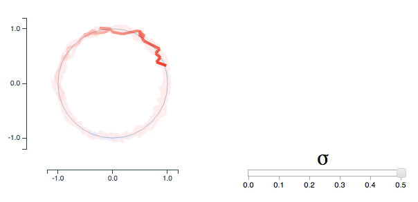

Effects of moderate noise on a limit cycle oscillator: Counterrotation and bistability ([Phys. Rev. Lett., 2014](http://arxiv.org/abs/1310.2227))

[http://people.mbi.ohio-state.edu/newby.23](http://people.mbi.ohio-state.edu/newby.23)

